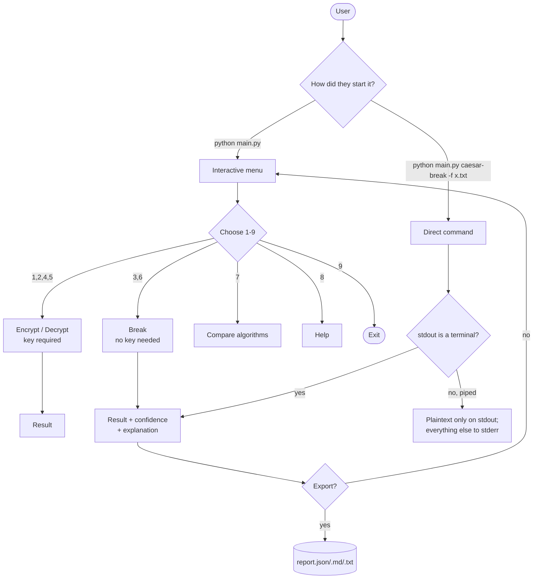
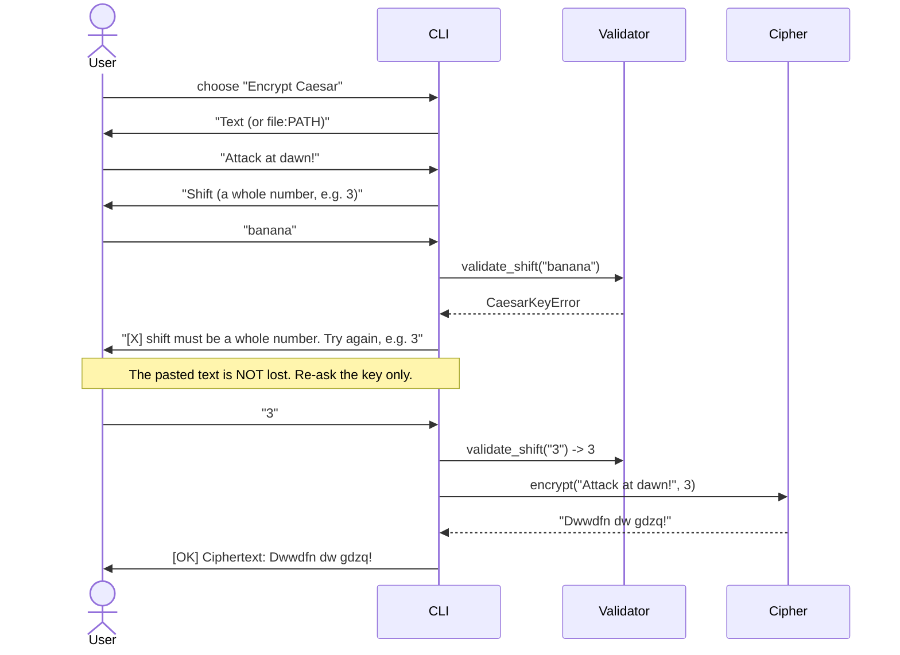
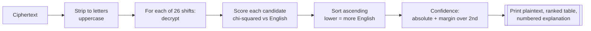
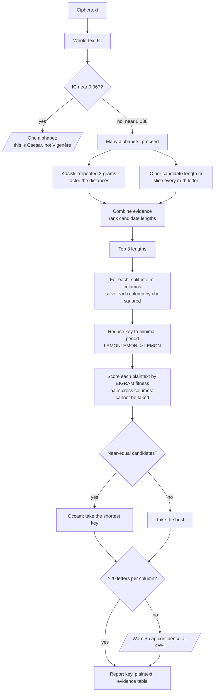
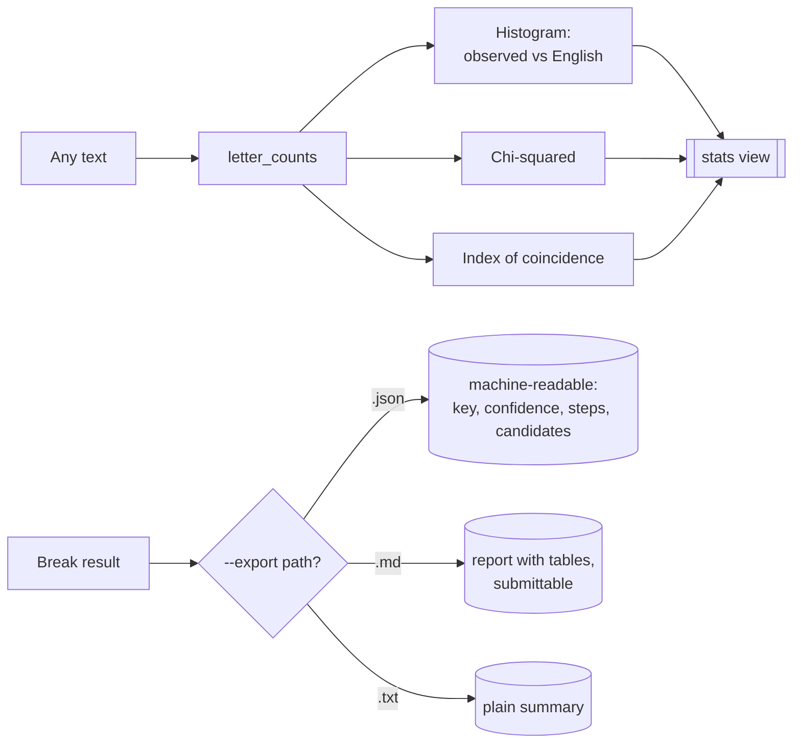
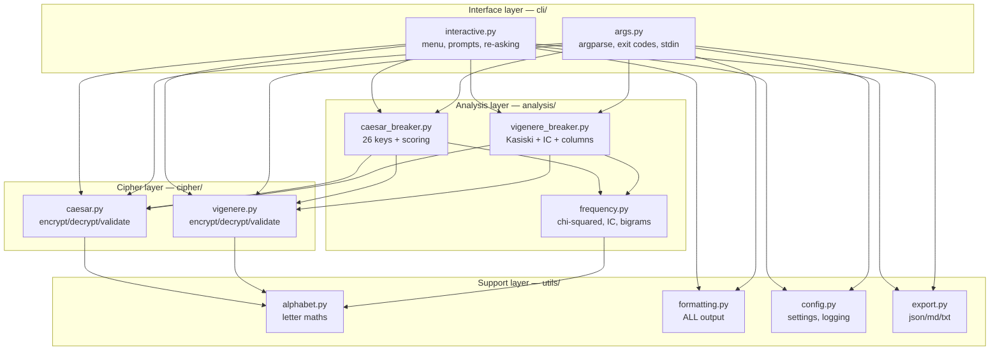

# Cipher Breaker — Product Requirements & Technical Design

*Phase 1 deliverable. Nineteen sections, written before the code.*

**Contents**

1. [Executive Summary](#1-executive-summary) · 2. [Beginner-Friendly Explanation](#2-beginner-friendly-explanation) · 3. [Product Requirements](#3-product-requirements-document) · 4. [User Journey](#4-user-journey) · 5. [UI / UX Design](#5-ui--ux-design) · 6. [Technical Architecture](#6-technical-architecture) · 7. [Folder Structure](#7-folder-structure) · 8. [Technology Stack](#8-technology-stack) · 9. [Cipher Design](#9-cipher-design) · 10. [Cryptanalysis Design](#10-cryptanalysis-design) · 11. [Security Review](#11-security-review) · 12. [Edge Cases](#12-edge-cases) · 13. [Testing Strategy](#13-testing-strategy) · 14. [Development Roadmap](#14-development-roadmap) · 15. [Learning Objectives](#15-learning-objectives) · 16. [Stretch Features](#16-stretch-features) · 17. [Deliverables Checklist](#17-final-deliverables-checklist) · 18. [Design Review](#18-design-review) · 19. [Implementation Order](#19-implementation-order)

---

## 1. Executive Summary

### Objective

Build a command-line tool that encrypts and decrypts messages with the Caesar and Vigenère ciphers, and then **breaks both of them without being given the key** — explaining every step as it goes.

### The problem being solved

Cryptography courses open with the Caesar and Vigenère ciphers and tell students they are insecure. Students believe it, because the lecturer said so. Believing something and *knowing* it are different states of mind, and only one of them survives contact with a bad idea later in a career.

The gap is that "insecure" is taught as a fact to memorise rather than a thing to witness. A student who has personally typed in a Vigenère message with a twelve-letter key — a keyspace of roughly 10<sup>17</sup>, larger than the number of grains of sand on a beach — and watched a laptop hand back the key in forty milliseconds has learned something that a slide cannot teach: **key size is not security**. That single misconception, carried into professional life, is behind a long tail of real breaches.

### Educational value

The tool is a demonstration instrument. It is deliberately built so that:

- the attack narrates itself (every result carries a numbered explanation),
- the statistics are visible (chi-squared, index of coincidence, key-length evidence tables), and
- the failures are visible too — feed it twelve letters and it reports low confidence rather than bluffing, which teaches that cryptanalysis is a *statistical* activity that needs data.

### Intended audience

| Audience | Needs from the tool |
|---|---|
| **Undergraduate student (primary)** | Complete a Ch. 1–2 assignment; understand what they submitted |
| **Lecturer / TA** | A live demo that survives a projector and a 10-minute slot |
| **Self-taught programmer** | A readable, well-tested example of a small layered Python application |
| **Hiring reviewer / hackathon judge** | Evidence of engineering judgement in a GitHub repository |

### Learning outcomes

After using and reading this project a student can:

1. Explain modular arithmetic and why `mod 26` makes the alphabet wrap.
2. Explain why a Caesar cipher has 26 keys and what that means in practice.
3. Explain how frequency analysis identifies English without a dictionary.
4. Explain what the index of coincidence measures and why a Caesar shift does not change it.
5. Perform a Kasiski examination and say why repeated ciphertext chunks leak the key length.
6. Explain the divide-and-conquer step that reduces 26<sup>m</sup> to 26 × m — the actual reason Vigenère fails.
7. State three concrete properties AES has that these ciphers lack.
8. Read a small layered Python codebase and add a third cipher without editing the existing two.

### Success criteria

| # | Criterion | Target | Result |
|---|---|---|---|
| S1 | Break Caesar on ≥ 40 letters of English | 100% of shifts | ✅ 26/26 |
| S2 | Break Vigenère, keys 1–12 letters, ≥ 400 letters of text | ≥ 95% | ✅ 100% in the test matrix |
| S3 | Speed on 1,000 letters | < 1 s | ✅ ~30 ms Caesar, ~50 ms Vigenère |
| S4 | Automated test coverage | ≥ 85% | ✅ 93% (204 tests) |
| S5 | Runs with zero third-party packages installed | required | ✅ `rich` optional, auto-fallback |
| S6 | A beginner reaches a broken cipher without reading docs | ≤ 3 prompts | ✅ menu → paste → result |
| S7 | Honest failure on insufficient data | warn, never bluff | ✅ confidence capped + warning |

---

## 2. Beginner-Friendly Explanation

*This section assumes you have never studied cryptography and defines every term before using it.*

### Passing notes in class

You want to send a note to a friend across the classroom. The problem is not the distance — it is everyone in between. Anyone can read a folded piece of paper.

So you agree on a trick beforehand: **every letter in the note gets replaced by the letter three places later in the alphabet.** A becomes D, B becomes E, and so on. Your note says `KHOOR` and your friend reads `HELLO`. The people in between see nonsense.

That is the whole idea, and it comes with four words worth learning:

| Word | Means | In the note |
|---|---|---|
| **Plaintext** | The readable message | `HELLO` |
| **Ciphertext** | The scrambled version | `KHOOR` |
| **Key** | The secret needed to reverse it | "three places" |
| **Cipher** | The *method* itself | "shift every letter" |

**Encryption** is turning plaintext into ciphertext. **Decryption** is turning it back. A **cipher** is the recipe; the **key** is the ingredient only you and your friend know.

### Why the recipe is not the secret

Here is the part that surprises people. The teacher can know exactly what your trick is — "they're shifting letters" — and still not read the note, as long as they do not know *how far*. That principle is old and it has a name: **Kerckhoffs's principle**, from 1883. It says a cipher must stay secure even when everyone knows how it works. Only the key is secret.

Modern cryptography lives by this rule. Every algorithm protecting your bank details is published, argued over publicly for years, and attacked by anyone who fancies a go. Secrecy about the *method* is not security, it is just a delay. Which brings us to the trouble with the classroom note.

### The trouble: there are only 26 tricks

Your teacher does not need to know your key. There are only 26 possible shifts, and one of them is "shift by 0". The teacher can try all 26 by hand in about a minute — and a computer does it faster than you can lift your finger off Enter.

This is a **brute-force attack**: try every key until one works. A cipher is only safe from brute force if there are too many keys to try. 26 is not too many. 26 is a coffee break.

### A better trick: use a word, not a number

So you improve the scheme. Instead of shifting *everything* by three, you and your friend memorise the word `LEMON`, and write it under the message over and over:

```
message:  A  T  T  A  C  K  A  T  D  A  W  N
keyword:  L  E  M  O  N  L  E  M  O  N  L  E
shift by: 11  4 12 14 13 11  4 12 14 13 11  4
result:   L  X  F  O  P  V  E  F  R  N  H  R
```

Look closely at the two A's at positions 1 and 4. The first became `L`; the fourth became `O`. **The same letter encrypted to two different letters.** That kills the easy attack, because now you cannot say "the most common ciphertext letter must be E".

This is the **Vigenère cipher**, published in the 1500s. It was considered unbreakable for roughly three hundred years and earned a nickname: *le chiffre indéchiffrable*, the indecipherable cipher.

### Why the better trick also fails

The keyword repeats. That is the crack, and everything in this project follows from it.

Think of it as a lock with five tumblers where each tumbler is a *separate, tiny lock*. If you had to pick all five at once, you would need 26<sup>5</sup> = 11.8 million attempts. But because the keyword repeats every five letters, an attacker can peel the message apart: take letters 1, 6, 11, 16... — every one of those was shifted by `L`. That pile is a plain Caesar cipher, and Caesar has 26 keys.

So the attacker picks each tumbler *on its own*: 26 × 5 = **130 attempts instead of 11.8 million**. The lock never had five tumblers' worth of strength. It had five tumblers' worth of *appearance*.

A twelve-letter key looks like 10<sup>17</sup> possibilities and costs 312 tries. That is the lesson this whole tool exists to deliver.

### Classical vs modern encryption

| | Classical (Caesar, Vigenère) | Modern (AES) |
|---|---|---|
| Works on | letters | blocks of raw bits |
| Key | a number or a word | 128 or 256 random bits |
| Hides letter patterns? | no — the fingerprint survives | yes — output is indistinguishable from random |
| Same input, same output? | always | no — a random IV changes it every time |
| Broken by | a laptop, in milliseconds | nothing known, after 25 years of public attack |
| Designed by | one clever person | decades of adversarial public competition |

The honest summary: classical ciphers *scramble*, and scrambling preserves structure. Modern ciphers *destroy structure*, which is a much harder thing to do and the reason they are built out of many rounds of mixing rather than one clever idea.

---

## 3. Product Requirements Document

### 3.1 Problem statement

Students are told classical ciphers are insecure without ever seeing one fall. Existing online cipher tools return an answer and no reasoning, which is worse than useless pedagogically: the student now has a working answer and no understanding, and has learned that cryptanalysis is a black box someone else owns.

We need a tool that treats the *explanation* as the product and the plaintext as a by-product.

### 3.2 Goals

| ID | Goal | Measured by |
|---|---|---|
| G1 | Encrypt/decrypt both ciphers correctly, including edge cases | S1, unit tests |
| G2 | Break both ciphers from ciphertext alone | S1, S2 |
| G3 | Explain every attack step in plain English | every result carries `steps[]` |
| G4 | Report honest confidence, including "not enough data" | S7 |
| G5 | Be usable by a beginner with no CLI experience | S6 |
| G6 | Be readable and extensible as a code sample | S4, review §18 |
| G7 | Run anywhere Python runs, with no mandatory dependencies | S5 |

### 3.3 Non-goals

Explicitly **out of scope**, and why:

| Not doing | Why not |
|---|---|
| Any real security use | These ciphers are broken. Building a "secure mode" would be a lie. |
| Modern ciphers (AES, RSA) implementations | Rolling your own AES is the classic beginner mistake. We *compare* to AES; we do not implement it. Use `cryptography`. |
| Languages other than English | The whole toolkit is English letter statistics. Supporting French means a French corpus and different constants — a good stretch feature, a bad hidden assumption. |
| GUI / web app | CLI keeps the focus on the algorithms. Listed as a stretch feature. |
| Non-alphabetic ciphers (Enigma, Playfair) | Different structure; out of Ch. 1–2 scope. Playfair is a stretch feature. |
| Breaking arbitrary substitution ciphers | Needs hill-climbing; a different (and much longer) project. |

### 3.4 User personas

**Priya — second-year CS student.** Has three assignments due. Wants to finish this one and not be embarrassed if asked how it works. Will run it once the night before, and will read exactly the parts that appear on screen. *Design implication: the on-screen explanation must be the documentation. If it is only in the README, she will not read it.*

**Dr. Okafor — lecturer.** Has ten minutes in a lecture and a projector at 1024×768. Cannot install anything on the lectern machine. Will type live and cannot afford a stack trace. *Design implication: zero mandatory dependencies; graceful, readable output at 80 columns; no crashes on weird input.*

**Sam — self-taught developer.** Found the repo on GitHub. Will read the code before running it, and will judge the project in ninety seconds by opening one random file. *Design implication: every module must be independently comprehensible; no file is allowed to be the ugly one.*

**Jordan — teaching assistant.** Marks 120 submissions. Needs to verify the tool's answers quickly and repeatably. *Design implication: scriptable subcommands, meaningful exit codes, JSON export.*

### 3.5 Functional requirements

| ID | Requirement | Priority |
|---|---|---|
| FR1 | Encrypt/decrypt Caesar with any integer key | Must |
| FR2 | Encrypt/decrypt Vigenère with any alphabetic keyword | Must |
| FR3 | Preserve case, spacing, punctuation and non-Latin characters | Must |
| FR4 | Break Caesar by frequency analysis, no key given | Must |
| FR5 | Break Vigenère by IC + Kasiski + per-column chi-squared | Must |
| FR6 | Show ranked candidates with scores | Must |
| FR7 | Show confidence, and warn when data is insufficient | Must |
| FR8 | Explain each attack step by step | Must |
| FR9 | Interactive menu mode | Must |
| FR10 | Argument mode with subcommands | Must |
| FR11 | Read input from `--text`, `--file`, or stdin | Should |
| FR12 | Export results as JSON / Markdown / text | Should |
| FR13 | Show frequency statistics (histogram, IC, chi-squared) | Should |
| FR14 | Compare Caesar / Vigenère / AES in a table | Should |
| FR15 | Accept a known key length to skip estimation | Could |
| FR16 | Benchmark mode | Could |

### 3.6 Non-functional requirements

| ID | Requirement | Target | Rationale |
|---|---|---|---|
| NFR1 | Break 1,000 letters | < 1 s | Live demo must not stall |
| NFR2 | Handle 100,000 letters | no crash | Students paste whole books |
| NFR3 | Zero mandatory dependencies | stdlib only | Lectern machines, locked-down labs |
| NFR4 | Test coverage | ≥ 85% | Confidence to refactor |
| NFR5 | Public functions documented | 100% | The code *is* courseware |
| NFR6 | Output readable without colour | always | Accessibility, piping, projectors |
| NFR7 | Python | 3.9+ | What labs actually have installed |
| NFR8 | Never crash on user input | always | Persona: Dr. Okafor, live |
| NFR9 | Startup time | < 200 ms | It should feel like a tool, not an app |

### 3.7 User stories & acceptance criteria

**US1 — As a student, I want to break a Caesar cipher without knowing the key, so that I can see frequency analysis work.**
- **Given** ciphertext of ≥ 40 English letters, **when** I run `caesar-break`, **then** the correct shift is ranked first, the plaintext prints, and a numbered explanation appears.
- **Given** ciphertext with no letters, **then** confidence is 0 and nothing crashes.

**US2 — As a student, I want to break a Vigenère cipher, so that I can see why a big keyspace is not security.**
- **Given** ≥ 400 letters and a key of ≤ 12 letters, **when** I run `vigenere-break`, **then** the key is recovered exactly, and the key-length evidence table is shown.
- **Given** only 12 letters, **then** a warning appears, confidence ≤ 0.45, and the tool does not claim success.

**US3 — As a lecturer, I want to run a live demo on a machine with nothing installed.**
- **Given** a bare Python 3.9+, **when** I run `python main.py`, **then** the menu appears with ASCII output and no import errors.

**US4 — As a beginner, I want to be told what to type.**
- **Given** the menu, **when** I choose an option, **then** every prompt states a valid example; **and** a bad key re-asks rather than exiting, without losing my pasted text.

**US5 — As a TA, I want machine-readable results.**
- **Given** `--export report.json`, **then** a JSON file appears containing the key, confidence, plaintext and steps; **and** the exit code is 0 on success, 1 on user error.

**US6 — As a curious user, I want to see the statistics.**
- **Given** `stats -f file`, **then** a histogram, IC and chi-squared appear, with English's values alongside for comparison.

### 3.8 Risks

| # | Risk | Likelihood | Impact | Mitigation | Status |
|---|---|---|---|---|---|
| R1 | **Attack over-fits and prefers a wrong long key** (a 20-letter key fits letter counts better than the true 5-letter one, because more free parameters always fit better) | High | High — silently wrong output | Judge candidates on *bigram* fitness, which per-column shifts cannot fake; apply Occam's razor among near-equals | ✅ Closed — was a real bug, caught by tests, see §10.7 |
| R2 | Short ciphertext → wrong key reported confidently | High | High — teaches the wrong lesson | Cap confidence, emit explicit warning, document the data requirement | ✅ Closed |
| R3 | Key length estimator returns a multiple of the true length | Medium | Medium | Length penalty + minimal-period reduction | ✅ Closed |
| R4 | `rich` unavailable on lab machine | Medium | High — demo dies | Optional import with ASCII fallback; tested both ways | ✅ Closed |
| R5 | Unicode input crashes the alphabet maths | Medium | Medium | Non-ASCII passes through untouched; tested | ✅ Closed |
| R6 | Students misuse it as real crypto | Low | High | Refuse to pretend: warnings in README, help, and exit message | ✅ Closed |
| R7 | Scope creep into a crypto library | Medium | Medium | Non-goals list, above | ✅ Managed |

### 3.9 Constraints

- **Time:** one term, part-time — roughly 30–40 hours.
- **Platform:** Python 3.9+, cross-platform, terminal-only.
- **Dependencies:** none mandatory (`rich` optional).
- **Corpus:** the bundled bigram corpus must be original text — no copyrighted material in the repo.
- **Ethics:** the tool attacks ciphers that have been publicly broken since 1863. It gives no capability against anything in modern use, which is exactly why it is safe to publish.

---

## 4. User Journey

### 4.1 Top level



### 4.2 Encrypting



### 4.3 Breaking Caesar



### 4.4 Breaking Vigenère



### 4.5 Statistics and export



---

## 5. UI / UX Design

A CLI is a user interface. It gets designed, or it gets designed badly by accident.

### 5.1 The menu

```
====================================
 Cipher Breaker
====================================
1. Encrypt Caesar
2. Decrypt Caesar
3. Break Caesar
4. Encrypt Vigenère
5. Decrypt Vigenère
6. Break Vigenère
7. Compare Algorithms
8. Help
9. Exit
====================================
```

Ordering is deliberate: **encrypt → decrypt → break**, twice. A student meets each cipher before meeting its downfall, which is the order the lesson has to happen in. Compare (7) sits after both attacks because it only lands once you have watched them work.

### 5.2 Colour

| Element | Colour | Non-colour signal |
|---|---|---|
| Titles | cyan | blank line + position |
| Success | green | `[OK]` prefix |
| Warnings | yellow | `[!]` prefix |
| Errors | red | `[X]` prefix |
| Best candidate | bold green | row 1 of the table |
| Secondary info | dim | parenthetical wording |

**Colour is never the only carrier of meaning.** Every state has a word or symbol. The rule is: print the output in greyscale, and if you have lost information, the design is wrong. Colour disables automatically when `--no-color` is passed, when `NO_COLOR` is set (the community convention), or when stdout is not a terminal.

### 5.3 Errors

Rules, in priority order:

1. **Never lose the user's work.** A bad key re-asks for the key, not for the pasted paragraph.
2. **Say what is valid.** `shift must be a whole number (got 'banana'). Try again, e.g. 3 or -5 or 29.`
3. **Errors are not failures of the user.** No "invalid input" scolding.
4. **Distinguish user error from tool error.** Exit code 1 vs a traceback. A traceback is a bug report.

### 5.4 Progress and loading

Breaking 100,000 letters takes a few seconds, and silence in a terminal reads as "hung".

- With `rich`: a spinner with a label ("Estimating key length…").
- Without: `Estimating key length... done (412.7 ms)`.
- **Piped or non-interactive: nothing at all**, so redirected output stays clean.

The timing is not decoration. It is the evidence for the project's central claim, so it is shown by default.

### 5.5 Input validation

| Input | Rule | On violation |
|---|---|---|
| Caesar key | any integer; wraps mod 26 | re-ask with an example |
| Vigenère key | non-empty, letters only | re-ask; **reject** rather than silently strip, so encrypt and decrypt can never disagree |
| Text | non-empty; `file:PATH` allowed | re-ask |
| Menu choice | 1–9 (plus hidden `s`) | re-ask, do not exit |
| Export path | `.json` / `.md` / `.txt` | name the supported formats |

### 5.6 Accessibility

- **Screen readers:** no ASCII art conveys meaning; tables have real headers; symbols precede content so a reader announces state first.
- **Colour blindness:** see 5.2 — every colour is redundant.
- **Low vision / projectors:** ≤ 80 columns; the confidence bar `[####------] 42%` carries its own number.
- **Motor:** no timed prompts, no mouse, Enter accepts defaults.
- **Cognitive:** one question per prompt; jargon defined in Help before use.

### 5.7 Keyboard and CLI usability

| Key / input | Does |
|---|---|
| Enter | accept the shown default |
| `q` / `quit` / `exit` | leave, from any prompt |
| Ctrl-C | leave cleanly (no traceback) |
| Ctrl-D (EOF) | same as quit — piping a script must not explode |
| `file:PATH` | read text from a file at any text prompt |
| `s` | hidden statistics view |

For scripting: subcommands over flags (`caesar-break`, not `--mode=break --cipher=caesar`), short and long options, `--help` on every subcommand with examples, `--version`, stdin support, and exit codes that mean something (0 / 1 / 2 / 130).

---

## 6. Technical Architecture

### 6.1 Layers



The pipeline in the brief — *User → CLI → Cipher Service → Analysis Engine → Frequency Analysis → Output Formatter* — is exactly this graph read top to bottom.

**The one rule: dependencies point downward.** `cipher/` does not know `analysis/` exists. Neither knows `cli/` exists. Nothing below `cli/` ever calls `print()`.

That rule is what makes the library importable from a notebook, a web app, or a test — and it is why the test suite can drive the menu with fake keystrokes and assert on captured stdout without a subprocess.

### 6.2 Module responsibilities

| Module | Owns | Deliberately does not |
|---|---|---|
| `cipher/caesar.py` | shift maths, key validation, brute force | score anything |
| `cipher/vigenere.py` | keyword schedule, encrypt/decrypt | guess keys |
| `analysis/frequency.py` | chi-squared, IC, bigram model, confidence | know which cipher it serves |
| `analysis/caesar_breaker.py` | try 26, rank, explain | print |
| `analysis/vigenere_breaker.py` | key length, columns, Occam's razor, explain | print |
| `utils/alphabet.py` | letter ↔ number, mod 26, case, Unicode folding | anything cipher-specific |
| `utils/formatting.py` | every byte of terminal output, colour policy | compute statistics |
| `utils/config.py` | settings precedence, logging setup | parse arguments |
| `utils/export.py` | serialisation of results | analysis |
| `cli/args.py` | argparse, input resolution, exit codes | algorithms |
| `cli/interactive.py` | menu loop, prompts, recovery | algorithms |

### 6.3 Key design decisions

**Results are data, not printouts.** `break_caesar()` returns a `CaesarBreakResult` dataclass carrying candidates, confidence, timings and `steps[]`. The CLI renders it; the exporter serialises it; the tests assert on it. Three consumers, one object, no duplicated logic — and the explanation is generated by the code that did the work, so it cannot drift out of sync with what actually happened.

**The explanation is generated, not written.** `steps[]` is built during the attack, quoting the real numbers. A hard-coded description would eventually lie.

**Two scoring models on purpose.** Chi-squared (unigram) solves each column. Bigram fitness judges whole candidate plaintexts. They are separate because the second exists to check the first — see §10.7 and risk R1.

**SOLID, briefly:** each module has one reason to change (SRP); a third cipher is a new file, not an edit (OCP); `caesar`, `vigenere` and any future cipher expose the same `encrypt`/`decrypt`/`validate_key` shape so callers are interchangeable (LSP); no fat interfaces to implement (ISP); the analysis layer depends on the *function signatures* of the cipher layer, not its internals (DIP).

---

## 7. Folder Structure

```
cipher-breaker/
├── README.md                  # Front door: what, why, 30-second demo
├── requirements.txt           # rich (OPTIONAL) — the tool runs without it
├── requirements-dev.txt       # pytest, pytest-cov
├── pyproject.toml             # packaging + tool config
├── config.json                # default settings, overridable
├── main.py                    # entry point; decides nothing, delegates everything
├── benchmark.py               # the evidence for "these ciphers are fast to break"
│
├── cipher/                    # THE CIPHERS. Reversible transformations only.
│   ├── caesar.py              # Knows nothing about attacks. Add a cipher here.
│   └── vigenere.py
│
├── analysis/                  # THE ATTACKS. Depends on cipher/, never the reverse.
│   ├── frequency.py           # Shared statistics: chi-squared, IC, bigram model
│   ├── caesar_breaker.py      # Brute force + scoring
│   └── vigenere_breaker.py    # Kasiski + IC + per-column solving
│
├── utils/                     # SUPPORT. No cipher knowledge above alphabet.py.
│   ├── alphabet.py            # Letter <-> number, mod 26, case, Unicode
│   ├── formatting.py          # Every byte of terminal output lives here
│   ├── config.py              # Settings precedence + logging setup
│   └── export.py              # json / md / txt serialisation
│
├── cli/                       # INTERFACE. The only layer allowed to print.
│   ├── args.py                # argparse mode, exit codes, stdin
│   └── interactive.py         # menu mode, prompts, error recovery
│
├── data/
│   └── english_corpus.txt     # Original prose; source of the bigram model
│
├── tests/                     # 204 tests, 93% coverage
│   ├── test_caesar.py         # unit
│   ├── test_vigenere.py       # unit
│   ├── test_frequency.py      # unit — includes the anti-overfitting test
│   ├── test_breakers.py       # integration + regression
│   ├── test_cli.py            # CLI contract: exit codes, stdout hygiene
│   ├── test_interactive.py    # menu driven by scripted keystrokes
│   └── test_utils.py          # alphabet, config, export, formatting
│
├── docs/
│   ├── PLANNING.md            # This document (PRD + design)
│   ├── INSTALL.md
│   ├── USER_GUIDE.md          # User manual
│   ├── DEVELOPER_GUIDE.md     # Architecture, how to add a cipher
│   ├── API.md                 # Module reference
│   ├── CRYPTOGRAPHY_NOTES.md  # The maths, properly
│   ├── SECURITY.md            # Why these fail; what to use instead
│   ├── TROUBLESHOOTING.md
│   └── WRITEUP.md             # The 2–4 page report
│
├── examples/                  # Sample ciphertexts, including one that FAILS
└── reports/                   # Exported results land here (gitignored)
```

**Why each folder exists:**

- `cipher/` and `analysis/` are separate because *the attacker and the defender are different roles*. Keeping them apart in the filesystem makes the dependency direction physical: `analysis` imports `cipher`, and if that arrow ever reversed you would notice immediately.
- `utils/` holds the things every layer needs. `formatting.py` is here rather than in `cli/` on purpose: it is a *renderer*, and someday a web front-end would want a different one, so it must be swappable.
- `data/` keeps the corpus out of the code. The model is data; treat it as data.
- `tests/` mirrors the source tree one-to-one, so there is never a question of where a test goes.
- `examples/` includes a case that fails on purpose. A demo folder where everything works teaches that the tool always works.
- `reports/` is gitignored: user output does not belong in version control.

---

## 8. Technology Stack

### 8.1 Programming language

| Option | For | Against | Verdict |
|---|---|---|---|
| **Python 3.9+** | Reads like pseudocode — the code *is* the lecture note; `%` handles negative modulus correctly out of the box; `collections.Counter`, `argparse`, `dataclasses` all free; installed on every lab machine | Slow (~100× C) | ✅ **Chosen.** The bottleneck is student comprehension, not CPU. 100k letters still breaks in ~2 s. |
| Rust | Fast, correct, great tooling | Borrow checker in front of a 19-year-old learning mod 26; `%` returns negative for negative operands — a real trap here | ❌ Wrong audience |
| JavaScript | Runs in a browser, zero install | `%` is broken for negatives (`-1 % 26 === -1`); no stdlib to speak of; a GUI hides the algorithm | ❌ Would undermine the teaching goal |
| C | The classic teaching language for this | Manual memory management, and every bug becomes a lesson about C rather than about ciphers | ❌ Distraction |

### 8.2 CLI framework

| Option | For | Against | Verdict |
|---|---|---|---|
| **argparse (stdlib)** | Zero dependencies (NFR3); subcommands, mutually-exclusive groups and `--help` all built in; every Python developer already reads it | Verbose; no colour | ✅ **Chosen.** NFR3 is non-negotiable — the lectern machine has no pip. |
| Click | Decorators are elegant; excellent UX defaults | A dependency, for ergonomics we do not need | ❌ Violates NFR3 |
| Typer | Type hints become the CLI; least code | Two dependencies (Typer + Click) | ❌ Same |
| Hand-rolled `sys.argv` | No dependency at all | Reinvents `--help`, badly | ❌ Not worth it |

### 8.3 Terminal output

| Option | Verdict |
|---|---|
| **rich, optional, with ASCII fallback** | ✅ **Chosen.** Tables and spinners when present; identical *information* when absent. Both paths are tested. |
| colorama | Colour only, no tables; still a dependency |
| rich, mandatory | ❌ Breaks NFR3 and persona Dr. Okafor |
| Raw ANSI everywhere | Tedious; breaks on old Windows terminals |

### 8.4 Testing framework

| Option | For | Against | Verdict |
|---|---|---|---|
| **pytest** | `assert` reads like English; `parametrize` turns "all 26 shifts" into one test; `capsys`/`monkeypatch` let us test the *menu* without a subprocess; fixtures for temp files | Dev dependency | ✅ **Chosen** (dev-only, so NFR3 holds) |
| unittest | Stdlib | `assertEqual` boilerplate; no parametrize; students write fewer tests when tests are tedious | ❌ |
| doctest | Examples double as tests | Can't express the matrix; brittle | ➕ **Used as well** — 14 doctests keep the docstring examples honest |

### 8.5 Packaging

| Option | Verdict |
|---|---|
| **`pyproject.toml` + runnable `main.py`** | ✅ **Chosen.** `git clone && python main.py` works with nothing installed — the beginner path. `pip install -e .` gives a `cipher-breaker` command for everyone else. Both, cheaply. |
| setup.py | Deprecated |
| Poetry / PDM | Another tool to install before the tool |
| PyInstaller binary | 50 MB artefact; hides the source, which *is* the deliverable |

### 8.6 Documentation

| Option | Verdict |
|---|---|
| **Markdown + Mermaid + Google-style docstrings** | ✅ **Chosen.** Renders on GitHub with no build step; diagrams are text, so they diff and review like code; docstrings serve `help()`, IDEs, and doctests at once. |
| Sphinx / Read the Docs | Professional, but a build pipeline for a term project nobody will run |
| MkDocs | Nice, still a build step |
| Images for diagrams | Binary blobs, undiffable, always out of date |

---

## 9. Cipher Design

### 9.1 Caesar cipher

**History.** Suetonius records that Julius Caesar shifted letters by three in his private correspondence around 50 BC. It worked, for a reason worth pausing on: most of his enemies could not read. The cipher's security rested on illiteracy, not on mathematics — an early lesson in the difference between a scheme being *unbroken* and being *strong*.

**Encryption.** For plaintext letter *x* (A=0…Z=25) and key *k* ∈ [0,25]:

> **E(x) = (x + k) mod 26**

**Decryption.**

> **D(y) = (y − k) mod 26**

**Shift logic.** `mod 26` is what wraps the alphabet: Z (25) + 3 = 28, and 28 mod 26 = 2 = C. Python's `%` returns a non-negative result for a positive modulus, so `(-1) % 26 == 25` — which is why negative keys need no special case. In C, Java or JavaScript this is a bug waiting to happen.

**Mathematics.** The 26 shifts form a **cyclic group** ℤ/26ℤ under addition: composing a shift of 3 with a shift of 4 gives a shift of 7, every shift has an inverse (26 − k), and k = 0 is the identity. That structure is exactly the weakness — the keyspace is small *and* the operation is transparent.

**Complexity.**

| Operation | Time | Space |
|---|---|---|
| Encrypt / decrypt | O(n) | O(n) output, O(1) working |
| Brute force (all keys) | O(26n) = O(n) | O(n) per candidate |
| Frequency attack | O(26n) = O(n) | O(1) — 26 counters |

**Limitations.** 26 keys. Preserves letter frequencies exactly. Preserves word lengths. Identical plaintext letters always give identical ciphertext letters. Any one of these is fatal; it has all four.

### 9.2 Vigenère cipher

**History.** Described by Giovan Battista Bellaso in 1553 and misattributed to Blaise de Vigenère ever since. Nicknamed *le chiffre indéchiffrable*. Charles Babbage broke it around 1854 but published nothing; Friedrich Kasiski published the method in 1863, and the name stuck to him. The Confederacy used it during the American Civil War — while Union cryptanalysts read the traffic. **A cipher that had already been broken for years was still being deployed in a war**, which is a durable lesson about the gap between the literature and the field.

**Key generation.** The keyword is repeated cyclically over the *letters* of the message. Punctuation and spaces do not consume a key letter — if they did, an attacker who knew the punctuation would learn the key stream's alignment for free.

```
message:  A  T  T  A  C  K  A  T  D  A  W  N
keyword:  L  E  M  O  N  L  E  M  O  N  L  E
shift:   11  4 12 14 13 11  4 12 14 13 11  4
cipher:   L  X  F  O  P  V  E  F  R  N  H  R
```

**Encryption.** For key letters k₀…k_(m−1) and the letter at position *i* (counting letters only):

> **E(xᵢ) = (xᵢ + k_(i mod m)) mod 26**

**Decryption.**

> **D(yᵢ) = (yᵢ − k_(i mod m)) mod 26**

**Repeating keys.** This is both the whole idea and the whole flaw. The repetition is what makes the cipher *practical* — two people can memorise `LEMON` — and it is what makes it breakable. Stop repeating, use a random key as long as the message, never reuse it, and you have the **one-time pad**, which is information-theoretically unbreakable and almost unusable. Every gram of Vigenère's convenience is paid for in security.

**Strengths.** *Polyalphabetic*: a single frequency count over the whole ciphertext is flat and useless. The same plaintext letter maps to different ciphertext letters. Keyspace 26<sup>m</sup> — for m=12, about 10<sup>17</sup>, well beyond brute force. It genuinely defeats the Caesar attack.

**Weaknesses.** The key repeats, so the ciphertext is m interleaved Caesar ciphers. Key length leaks through repeated ciphertext chunks (Kasiski) and through the index of coincidence. Once m is known, the cipher collapses: 26<sup>m</sup> → 26 × m. A short key on long text is catastrophic; reusing a key across messages is worse.

**Complexity.**

| Operation | Time | Space |
|---|---|---|
| Encrypt / decrypt | O(n) | O(m) |
| Naive brute force | O(26<sup>m</sup> · n) — hopeless | — |
| **Actual attack** | O(n · L + 26 · m · n/m) = **O(n · L)** for L candidate lengths | O(n) |

Read that last row twice. The attack is *linear in the message length* and does not depend on 26<sup>m</sup> at all.

---

## 10. Cryptanalysis Design

### 10.1 Frequency analysis

Al-Kindi described it in Baghdad in the 9th century — the first recorded cryptanalytic technique in history, and it still works today on anything that preserves letter identity.

The premise: **English is lumpy, and both ciphers preserve the lumps.** Caesar slides them around the alphabet without changing their shape. Vigenère interleaves several sets of lumps — but does not remove them.

### 10.2 Letter frequencies

| Letter | Freq | Letter | Freq | Letter | Freq |
|---|---|---|---|---|---|
| E | 12.70% | R | 5.99% | W | 2.36% |
| T | 9.06% | H | 6.09% | F | 2.23% |
| A | 8.17% | D | 4.25% | G | 2.02% |
| O | 7.51% | L | 4.03% | Y | 1.97% |
| I | 6.97% | C | 2.78% | P | 1.93% |
| N | 6.75% | U | 2.76% | B | 1.49% |
| S | 6.33% | M | 2.41% | V | 0.98% |
| | | | | K, J, X, Q, Z | < 1% |

E appears **170× more often than Z**. That ratio is the attack surface.

### 10.3 The chi-squared test

We need a machine-checkable answer to "does this look like English?".

> **χ² = Σ_letters (observed − expected)² / expected**

where *expected* = (English frequency of that letter) × (total letters).

Read it as a **penalty**: 0 is a perfect match, and it grows as the text departs from English.

- *Why squared?* So over- and under-shoots do not cancel, and so one wildly wrong letter outweighs several slightly wrong ones.
- *Why divide by expected?* Scale. Being 10 counts over on Z (expected: 0.4) is far more damning than being 10 over on E (expected: 63). Without the division, rare letters would be ignored — and rare letters are the most informative.

Typical values, ~500 letters of English: **10–40**. A wrong Caesar shift: **200–2000**.

### 10.4 Index of coincidence

> **IC = Σ_letters nᵢ(nᵢ − 1) / N(N − 1)**

The probability that two letters drawn at random from the text are the same letter.

| Text | IC |
|---|---|
| English | ≈ 0.0667 |
| Random letters | ≈ 0.0385 (= 1/26) |
| Caesar-encrypted English | **≈ 0.0667 — unchanged** |
| Vigenère, long key | → 0.0385 |

**The crucial property: the IC is invariant under any relabelling of the alphabet.** Shifting English does not change how often two letters match — it only changes *which* letters. So the IC sees straight through Caesar, and one number distinguishes "one alphabet" from "many". (This is asserted in `tests/test_frequency.py::test_invariant_under_caesar_shift` — the property is important enough to pin down.)

Friedman's 1922 estimate for key length follows from the same statistic:

> **m ≈ 0.027N / ((N−1)·IC − 0.038N + 0.065)**

We use the per-slice IC method instead, which is more robust for short texts, but the idea is Friedman's.

### 10.5 Kasiski examination

Kasiski, 1863. If a word lands on the same part of the key twice, it encrypts identically both times:

```
plaintext:  ...THE...........THE...
key:        ...KEY...........KEY...
ciphertext: ...DLC...........DLC...
            |<--- 15 letters --->|
```

The distance between the repeats is a multiple of the key length. Collect the distances between all repeated 3-grams, factor them, and the true key length is the factor that keeps appearing.

Why 3-grams and not 2? Two-letter repeats happen by chance constantly. Three-letter coincidences are rare enough to be signal — mostly.

### 10.6 Key length detection: combining the evidence

Neither method is trustworthy alone. Kasiski votes for the true length *and* for all of its factors, and chance repeats add noise. The IC scores multiples of the true length as well as the length itself.

So we combine:

> **score(m) = closeness(m) + 0.35 · kasiski_share(m) − 0.012 · (m − 1)**

where `closeness(m)` maps the average per-column IC from random (0) to English (1). The last term is Occam's razor as a nudge: when 5 and 10 fit equally, prefer 5.

### 10.7 Scoring algorithms — and a bug worth keeping

Solving each column uses chi-squared. Choosing *between candidate key lengths* must not.

**Here is the trap this project fell into, and it is the most instructive thing in the repository.**

A 20-letter key has 20 free parameters; the true 5-letter key has 5. More parameters always fit the data at least as well. So when the breaker judged candidates by chi-squared, it happily reported a 20-letter key whose plaintext was visible garbage — because the garbage's *letter counts* were beautiful. The optimiser had learned to satisfy the scorer instead of doing the job.

Measured, on a real run with true key `LEMON`:

| Candidate length | Recovered key | χ²-based score (lower=better) | Plaintext |
|---|---|---|---|
| 5 | `LEMON` | 92.2 | perfect English |
| **20** | `LEMHGLEMONEXMONLXMON` | **77.9 — "better"** | **garbage** |

The fix is not a bigger penalty; it is a **second opinion the optimiser cannot bribe**. Letter *pairs* run across the column boundaries, so no choice of per-column shifts can manufacture them:

> **fitness = (1/(n−1)) · Σ log₁₀ P(letter pair | English)**

Higher is better. Calibrated on prose held out of the training corpus (not on the corpus itself, which would flatter the model and inflate every confidence figure the tool prints):

| Text | Fitness |
|---|---|
| English | ≈ −2.30 |
| Random letters | ≈ −3.25 |
| Vigenère ciphertext | ≈ −3.21 |

Add-one (Laplace) smoothing keeps a single unusual pair like `ZQ` from sending the score to −∞.

The general lesson, and the reason this is documented rather than quietly fixed: **when a search optimises a metric, that metric stops being a fair judge of the search.** It is the same failure as training and testing on the same data. Regression tests now pin it (`test_cannot_be_faked_by_letter_counts`, `test_key_length_not_confused_by_multiples`).

### 10.8 Dictionary matching

A cheap tie-breaker: what fraction of whitespace-separated tokens are among the 60 most common English words? Worth up to a 30% discount on the chi-squared penalty. It is a *bonus signal only* — classical ciphertext is often written in unbroken five-letter blocks, where this returns 0 and must not be mistaken for "not English".

### 10.9 Confidence metrics

Two things justify confidence: the winner looks like English **in absolute terms**, and it is **clearly ahead of the runner-up**. A winner scoring 40 against a runner-up at 45 is a coin toss; 40 against 400 is a result.

> **confidence = 0.5 · absolute + 0.5 · margin**  (Caesar)
> **confidence = 0.6 · absolute + 0.4 · margin**  (Vigenère, on fitness)

Capped at **0.45** whenever a key position has fewer than 20 letters behind it. This is a display heuristic, not a probability, and the code says so. It exists to stop the tool bluffing — a wrong answer delivered confidently teaches a student the opposite of the lesson.

---

## 11. Security Review

### 11.1 Brute force

| Cipher | Keyspace | Time at 10⁹ keys/sec |
|---|---|---|
| Caesar | 26 | instant (26 tries) |
| Vigenère, m=5 | 1.2 × 10⁷ | 0.01 s |
| Vigenère, m=12 | 9.5 × 10¹⁶ | ~3 years |
| **Vigenère, m=12, *smart*** | **312 tries** | **~40 ms** |
| AES-128 | 3.4 × 10³⁸ | 10²² years |
| AES-256 | 1.2 × 10⁷⁷ | 10⁵⁷ years |

Row four is the point of this project. The naive keyspace never mattered.

### 11.2 Frequency analysis

Fatal to Caesar with ~40 letters. Fatal to Vigenère once the key length is known — which the IC hands over. Modern ciphers are immune by construction: AES output is statistically indistinguishable from random, so there is no fingerprint to find.

### 11.3 Known-plaintext attack

*The attacker has some plaintext and its matching ciphertext.*

- **Caesar:** one letter pair reveals the key. Total break.
- **Vigenère:** m known letters reveal the whole key by subtraction.
- **AES:** no known-plaintext attack better than brute force. This is a *design requirement*, not luck.

Realistic: message headers, `Dear Sir`, `--BEGIN`, the date. Historically, guessing that a German weather report contained *WETTER* helped break Enigma daily.

### 11.4 Chosen-plaintext attack

*The attacker can encrypt texts of their choosing.*

- **Caesar:** encrypt `A`. Read the key off the output.
- **Vigenère:** encrypt `AAAA…`. The ciphertext **is** the key, repeated. Total, immediate break.
- **AES:** secure under CPA in a proper mode (CBC/GCM with a random IV). Note that AES in ECB mode is **not** — the famous Linux-penguin image, still recognisable after "encryption", is exactly this failure. Even a perfect cipher can be used in a way that leaks structure.

### 11.5 Dictionary attacks

Human-chosen keys are words. `LEMON`, `SECRET`, `PASSWORD` — a 100k-word list beats 26<sup>m</sup> for any real-world key, and this remains true today: the modern equivalent is a password list, and it is still how most accounts actually fall.

### 11.6 Modern computing power

Caesar was safe in 50 BC against people who could not read. Vigenère was safe in 1553 against people doing arithmetic with a quill. Both assumptions expired. **The attacker's capabilities always increase, and never decrease** — which is why "no one has broken it yet" is not a security claim, and why AES-256 is specified with a margin against machines that do not exist.

### 11.7 Comparison with AES

| Property | Caesar | Vigenère | AES-256 |
|---|---|---|---|
| Year | 50 BC | 1553 | 2001 |
| Key | 1 number | m letters | 256 random bits |
| Keyspace | 26 | 26<sup>m</sup> | 1.2 × 10⁷⁷ |
| **Effective** work to break | **26** | **26 × m** | **2²⁵⁶** |
| Unit | letter | letter | 128-bit block |
| Diffusion (1 input bit changes ~half the output) | none | none | yes, by design |
| Confusion (output/key relation is complex) | none | none | yes, by design |
| Same input → same output | always | always | no (random IV) |
| Statistical fingerprint | full | partial | none detectable |
| Public scrutiny | none | none | 25+ years, worldwide |
| Status | **broken (9th c.)** | **broken (1863)** | **unbroken** |

**What AES has that these lack:**

1. **Confusion and diffusion** (Shannon, 1949). Flip one plaintext bit and about half the output bits change, unpredictably. Caesar changes exactly one letter.
2. **Many rounds.** 14 rounds of substitution, permutation and mixing. Classical ciphers apply one simple operation once.
3. **Non-linearity.** AES's S-box is deliberately non-linear; Caesar and Vigenère are *linear* in ℤ/26ℤ, and linear systems are solvable systems.
4. **Adversarial public design.** AES was selected through an open five-year competition in which the world's cryptanalysts tried to break every candidate.
5. **Semantic security in a proper mode.** Encrypt the same message twice, get different ciphertext.

**Use in practice:** never write your own. Use `cryptography` (Python), libsodium, or your platform's audited primitives — AES-GCM or ChaCha20-Poly1305, with keys from a KDF, not from a passphrase you thought of. Authenticate as well as encrypt: an attacker who can flip bits undetected has often already won.

---

## 12. Edge Cases

Every row below is a test in `tests/`.

| Case | Behaviour | Rationale | Test |
|---|---|---|---|
| Empty string | returns `""`; break gives confidence 0 | Not an error. A user pressing Enter deserves an answer, not a traceback. | `test_empty_string` |
| Whitespace only | preserved exactly | Non-letters are not the cipher's business | `test_whitespace_only` |
| Numbers | pass through untouched | `Attack at 5am` must survive; `5` has no alphabet position | `test_non_letters_untouched` |
| Symbols / emoji | pass through untouched | Same rule, consistently | `test_unicode_passthrough` |
| Mixed case | case preserved per letter | `AbC` + 1 = `BcD` — readability matters for a teaching tool | `test_preserves_case` |
| Unicode (é, 你好) | passes through; folding available for accents | Correctness over silent mangling. `letters_only` sees ASCII letters only. | `test_unicode_passthrough` |
| Very long text (100k+) | linear time, no recursion | Students paste whole books | `test_very_long_text` |
| Invalid Caesar key (`"banana"`, `2.5`, `True`) | `CaesarKeyError` + example | `True` is an `int` in Python — rejected explicitly, or `encrypt(x, True)` would silently mean shift 1 | `test_invalid_keys_rejected` |
| Invalid Vigenère key (`""`, `"key1"`, `"two words"`) | `VigenereKeyError` | **Reject, never strip.** Silently turning `lemon 5` into `LEMON` means encrypt and decrypt could disagree. | `test_invalid_keys_rejected` |
| Negative shift (−1) | = 25 | Python's `%` handles it; asserted so a port cannot regress | `test_normalisation` |
| Large shift (29, 260) | = 3, 0 | mod 26 | `test_normalisation` |
| Key longer than text | works; extra letters unused | `effective_key_length` reports the truth | `test_key_longer_than_text` |
| Single-letter Vigenère key | ≡ Caesar; breaker returns the 1-letter key | The minimal-period reduction earns its keep here | `test_single_letter_key_is_caesar` |
| Repeating key (`AAAB`) | handled | Reduction must not over-reduce | `test_repeated_key_letters` |
| Text with no letters (`"12345 !!!"`) | χ² = ∞, confidence 0, no crash | Division-by-zero guard with an honest answer | `test_no_letters_gives_zero_confidence_not_crash` |
| Ciphertext too short for stats | warns, caps confidence at 45% | The alternative is lying | `test_short_text_warns_instead_of_lying` |
| Missing corpus file | warns, bigram scoring degrades | Missing data must not be fatal | (graceful path in `_load_bigram_model`) |
| Malformed `config.json` | warns, uses defaults | The tool must always start | `test_malformed_file_does_not_crash` |
| Ctrl-D at a prompt | clean exit | Piping a script must not raise `EOFError` | `test_eof_exits_cleanly` |
| Missing file argument | exit 1 + message, no traceback | Tracebacks are bug reports, not UX | `test_missing_file_is_user_error` |

---

## 13. Testing Strategy

**204 tests, 93% coverage, 7 seconds.** The suite has to be fast, because a suite that takes a minute is a suite students stop running.

### 13.1 Levels

| Level | Files | Count | Tests what |
|---|---|---|---|
| **Unit** | `test_caesar.py`, `test_vigenere.py`, `test_frequency.py`, `test_utils.py` | ~120 | Each function alone: maths, validation, edge cases |
| **Integration** | `test_breakers.py` | ~35 | encrypt → break → recover, end to end |
| **CLI contract** | `test_cli.py` | ~20 | Exit codes, stdout hygiene, files, export |
| **Interactive** | `test_interactive.py` | ~18 | The menu, driven by scripted keystrokes |
| **Property** | in `test_frequency.py` | 3 | IC invariance; fitness scale-independence |
| **Doctest** | in the modules | 14 | Every docstring example actually runs |
| **Performance** | `benchmark.py` | — | Timings, reported not asserted |
| **Regression** | `TestRegression` | 3 | Bugs that happened, pinned forever |

### 13.2 Notable tests

**The round-trip matrix.** `@pytest.mark.parametrize("shift", range(26))` — one test, 26 cases, the entire Caesar keyspace. The same idea covers Vigenère keys of length 1, 2, 5, 12 and one with repeated letters.

**The property test that matters.**
```python
def test_invariant_under_caesar_shift(self):
    assert math.isclose(index_of_coincidence(ENGLISH),
                        index_of_coincidence(caesar.encrypt(ENGLISH, 13)))
```
This is not a unit test; it is the mathematical claim the whole Vigenère attack rests on. If it ever fails, the theory is wrong, not the code.

**The anti-overfitting test.**
```python
def test_cannot_be_faked_by_letter_counts(self):
    # Shuffled English: identical letter counts, no English structure.
    assert bigram_fitness(shuffled) < bigram_fitness(ENGLISH)
```
Encodes §10.7's lesson as an executable assertion.

**The failure test.** `test_short_text_warns_instead_of_lying` asserts the tool *fails* on 12 letters. A test suite that only tests success teaches that the tool always succeeds.

**Interactive tests without a subprocess.** `monkeypatch` replaces `input()` with a scripted queue; `capsys` captures the output. The menu is testable because it never computes anything — the layering pays for itself.

### 13.3 Sample cases

| Input | Expectation |
|---|---|
| `encrypt("Attack at dawn!", 3)` | `"Dwwdfn dw gdzq!"` |
| `encrypt("xyz", 3)` | `"abc"` (wrap) |
| `vigenere.encrypt("ATTACKATDAWN", "LEMON")` | `"LXFOPVEFRNHR"` (textbook vector) |
| `break_caesar(encrypt(text, k))` for k in 0..25 | `.key == k` |
| `break_vigenere(encrypt(long, "CRYPTOGRAPHY"))` | `.key == "CRYPTOGRAPHY"`, confidence 100% |
| `break_vigenere(encrypt("Meet me at noon", "SPY"))` | warning; confidence ≤ 0.45 |
| `caesar-encrypt -k abc` | exit 1, message, no traceback |

### 13.4 Coverage goals

| Module | Target | Actual |
|---|---|---|
| `cipher/` | 100% | **100%** |
| `analysis/` | ≥ 95% | **96–100%** |
| `utils/alphabet.py` | 100% | **100%** |
| `cli/` | ≥ 85% | 89% / 99% |
| Overall | ≥ 85% | **93%** |

The uncovered remainder is defensive branches (`rich` present *and* absent cannot both run in one process) and `KeyboardInterrupt` handlers. Coverage is a smoke detector, not a certificate: 100% coverage with weak assertions is worse than 85% with sharp ones, because it feels safe.

### 13.5 What is deliberately not tested

- **`rich`'s own rendering.** Not our library.
- **Exact chi-squared values.** Tested by *relation* (English < gibberish), not magic numbers, so the corpus can improve without breaking the suite.
- **Every Unicode script.** One representative case each for accented Latin, CJK and emoji.

---

## 14. Development Roadmap

| # | Milestone | Objectives | Difficulty | Est. | Actual | Definition of Done |
|---|---|---|---|---|---|---|
| **M1** | Foundations | `utils/alphabet.py`, project skeleton, `mod 26` maths | 🟢 Easy | 2 h | 1.5 h | Letter↔number round-trips; negative and >26 shifts correct; 100% covered |
| **M2** | Caesar cipher | encrypt, decrypt, key validation, brute force | 🟢 Easy | 3 h | 2 h | Textbook vector passes; all 26 shifts round-trip; case/punctuation/Unicode preserved |
| **M3** | Vigenère cipher | key schedule, encrypt, decrypt, validation | 🟡 Medium | 4 h | 3 h | `ATTACKATDAWN`+`LEMON`→`LXFOPVEFRNHR`; punctuation doesn't advance the key |
| **M4** | Frequency toolkit | counts, χ², IC, scoring | 🟡 Medium | 4 h | 3 h | IC invariance property test passes; English scores better than gibberish |
| **M5** | Caesar breaker | brute force + scoring + explanation | 🟡 Medium | 3 h | 2 h | All 26 shifts recovered from ≥40 letters; `steps[]` populated |
| **M6** | Vigenère breaker | Kasiski, IC, per-column solving | 🔴 Hard | 8 h | 10 h | Keys 1–12 recovered from ≥400 letters. **Overran: the over-fitting bug (§10.7) cost ~3 h and produced the bigram model.** |
| **M7** | CLI — arguments | argparse, subcommands, stdin, exit codes | 🟡 Medium | 4 h | 3 h | Every FR reachable; piped output is plaintext only |
| **M8** | CLI — interactive | menu, prompts, error recovery | 🟡 Medium | 4 h | 3 h | Bad input never exits or loses text; Ctrl-C/Ctrl-D clean |
| **M9** | Output & polish | rich + ASCII fallback, colour policy, progress | 🟡 Medium | 4 h | 3 h | Identical information with `--no-color`; no escape codes when piped |
| **M10** | Config, logging, export | settings precedence, JSON/MD/TXT | 🟢 Easy | 3 h | 2 h | Malformed config warns and starts; three formats round-trip |
| **M11** | Test suite | unit, integration, CLI, interactive, regression | 🟡 Medium | 6 h | 6 h | ≥85% coverage; suite < 10 s |
| **M12** | Docs & write-up | README, guides, notes, report, slides | 🟡 Medium | 8 h | 8 h | A stranger can install, run and explain the project |
| | **Total** | | | **53 h** | **46.5 h** | |

**The honest retrospective:** M6 was estimated at 8 hours and took 10, and the overrun was not the algorithm — Kasiski and the IC worked on the first afternoon. It was discovering that the breaker was scoring its own homework (§10.7). The estimate assumed the hard part would be *writing* the attack; the hard part was *not believing* it.

---

## 15. Learning Objectives

| Topic | What is learned | Where it lives |
|---|---|---|
| **Classical cryptography** | Substitution vs transposition; mono- vs polyalphabetic; Kerckhoffs's principle; why "unbreakable" claims age badly | §2, §9, `cipher/` |
| **Modular arithmetic** | ℤ/26ℤ as a cyclic group; wrapping; why negative keys need no special case in Python but do in C/Java/JS; identity and inverse | §9.1, `utils/alphabet.py` |
| **Frequency analysis** | Language as a measurable fingerprint; χ² as a distance; IC and its shift-invariance; Kasiski; divide and conquer | §10, `analysis/frequency.py` |
| **Statistics done honestly** | Sample size determines what you may claim; calibration on held-out data; confidence that reports doubt; **when a search optimises a metric, that metric stops being a fair judge** | §10.7, §10.9 |
| **Python** | Dataclasses, `Counter`, `%` semantics, generators, optional imports, type hints, docstrings and doctests | throughout |
| **CLI design** | Subcommands; stdout/stderr discipline; exit codes; `NO_COLOR`; accessibility; never lose the user's input | §5, `cli/` |
| **Testing** | Parametrised matrices; property tests; regression tests as institutional memory; testing failure paths; coverage as a smoke detector | §13, `tests/` |
| **Software architecture** | Layering; unidirectional dependencies; results as data; SOLID applied to a small program; why the renderer is separate | §6 |
| **Security thinking** | Attack models (ciphertext-only, known-plaintext, chosen-plaintext); keyspace ≠ security; don't roll your own; attackers only get stronger | §11 |

**The one sentence a student should leave with:** *A twelve-letter Vigenère key has 10¹⁷ possibilities and falls in forty milliseconds, because the key repeats — so the size of the keyspace tells you almost nothing about the strength of the cipher.*

---

## 16. Stretch Features

| Feature | Value | Difficulty | Notes |
|---|---|---|---|
| **Visualisation of frequency distributions** | 🔥 High | 🟢 Easy | Already half-built (`histogram_rows`); an in-terminal chart makes the fingerprint *visible*, which is the whole idea |
| **Real-time attack animation** | 🔥 High | 🟡 Medium | Watch 26 candidates re-rank live; the single best demo upgrade for a lecture |
| **Heatmaps** | High | 🟡 Medium | Column × shift χ² grid — the divide-and-conquer step becomes a picture |
| **Affine cipher** | High | 🟢 Easy | E(x)=(ax+b) mod 26; teaches modular *inverses* and why gcd(a,26)=1 matters. Best next cipher. |
| **Playfair** | Medium | 🔴 Hard | Digraphs; needs a different attack entirely |
| **Hill cipher** | Medium | 🔴 Hard | Matrix algebra mod 26; known-plaintext attack is elegant |
| **Web version** | High | 🟡 Medium | The library layer is already UI-free; a Flask front end is a renderer swap |
| **GUI version** | Medium | 🟡 Medium | Same argument; lower teaching value than the web |
| **PDF export** | Medium | 🟢 Easy | Markdown → PDF; students want something to hand in |
| **Benchmark mode** | Medium | 🟢 Easy | ✅ **Shipped** (`benchmark.py`) |
| **Multi-language** (FR/DE/ES) | High | 🟡 Medium | Swap the frequency table and corpus. Reveals that the *method* is language-independent while the *constants* are not — a subtle and valuable point. |
| **Substitution cipher solver** | 🔥 High | 🔴 Hard | Hill-climbing with the bigram model already in the repo; a proper term project on its own |
| **Interactive tutorial mode** | High | 🟡 Medium | Walk a student through breaking one message by hand, then show the code doing it |

**If only one:** the real-time attack animation. This project's product is comprehension, and watching the candidates re-rank as the evidence arrives teaches more than any table of results.

---

## 17. Final Deliverables Checklist

| # | Deliverable | Status | Where |
|---|---|---|---|
| 1 | Complete Python source | ✅ | `cipher/`, `analysis/`, `utils/`, `cli/` |
| 2 | CLI application (both modes) | ✅ | `main.py` |
| 3 | Unit tests | ✅ 204 tests, 93% | `tests/` |
| 4 | Documentation | ✅ 9 documents | `docs/` |
| 5 | README | ✅ | `README.md` |
| 6 | Architecture diagrams | ✅ Mermaid ×6 | §4, §6 |
| 7 | Sample encrypted texts | ✅ 6 files, one failing on purpose | `examples/` |
| 8 | Sample outputs | ✅ | `README.md`, `docs/USER_GUIDE.md` |
| 9 | User guide | ✅ | `docs/USER_GUIDE.md` |
| 10 | Cryptanalysis report | ✅ | `docs/WRITEUP.md` |
| 11 | Installation guide | ✅ | `docs/INSTALL.md` |
| 12 | Developer guide | ✅ | `docs/DEVELOPER_GUIDE.md` |
| 13 | API documentation | ✅ | `docs/API.md` |
| 14 | Cryptography notes | ✅ | `docs/CRYPTOGRAPHY_NOTES.md` |
| 15 | Security notes | ✅ | `docs/SECURITY.md` |
| 16 | Troubleshooting guide | ✅ | `docs/TROUBLESHOOTING.md` |
| 17 | Benchmark script | ✅ | `benchmark.py` |
| 18 | Presentation | ✅ 12 slides | `presentation.pptx` |
| 19 | GitHub-ready repo | ✅ | licence, `.gitignore`, `pyproject.toml` |

---

## 18. Design Review

*Seven reviewers, seven agendas. Scores out of 10, with the criticism kept in — a review where everyone scores 10 was not a review.*

### Product Manager — 8/10

Sharp problem statement, real personas, honest non-goals. The success criteria are measurable and were measured. Risk R1 was found by testing rather than by luck, which says the process worked.

*Criticism:* No usage telemetry, so "did students understand better?" is unmeasured — the actual goal is unverified. The stretch list is ambitious for a term project; shipping the animation would have been worth more than the third export format.
*Improve:* One evaluation with five real students before adding features.

### Cryptography Professor — 9/10

The mathematics is correct and, more importantly, *motivated*: χ² is explained as a penalty with a reason for each term, the IC's shift-invariance is stated and then tested as a property, and Kasiski is derived rather than asserted. §10.7's over-fitting discussion is better than most textbook treatments, and the attribution history (Bellaso not Vigenère; Babbage before Kasiski) is right.

*Criticism:* Friedman's formula is mentioned but not implemented. No treatment of the one-time pad's *proof* of security — the natural next step from "stop repeating the key". The corpus is small (~6 KB) for a bigram model; a larger one would sharpen the fitness scale.
*Improve:* Implement Friedman as a third estimator and show the students where the three methods disagree. Disagreement is where learning happens.

### Security Engineer — 8/10

Correct threat framing throughout; the attack models are distinguished properly; the ECB-penguin note lands the "even a good cipher can be used badly" point. Refuses to offer a "secure mode", which is the right call. Ships no vulnerabilities because it ships no security claims.

*Criticism:* `--file` reads arbitrary paths with no size limit — a 4 GB file is an easy self-DoS. The tool trusts its own corpus file without an integrity check. No `SECURITY.md` policy for reporting issues *in the tool*.
*Improve:* Cap input size with a clear message; document the trust boundary explicitly.

### Python Engineer — 9/10

Clean layering with dependencies genuinely pointing one way. Dataclasses for results is the right shape. Optional `rich` handled properly and *both paths tested*. Type hints throughout; docstrings that teach; doctests that keep the examples honest. `bool` explicitly rejected as an int key — a detail most code misses.

*Criticism:* `utils/formatting.py` has grown to ~300 lines and mixes policy (when to colour) with rendering (how to draw a table); it will be the first file to become unpleasant. `cli/args.py::run()` is a long if/elif chain — fine at 8 commands, poor at 15; a dispatch table is overdue. Importing `_ascii_table` (a private name) from `cli/` breaks the module's own encapsulation.
*Improve:* Split `Formatter` into policy and renderer; dispatch dict for subcommands; make `_ascii_table` public or move the caller.

### Teaching Assistant — 9/10

Runs on a bare machine, which is the actual constraint. The explanation output means students can answer "how does it work?" without reading the code. The deliberately failing example is the best teaching decision in the repo. Marking is easy: JSON export plus meaningful exit codes.

*Criticism:* No exercises. A student can run it, watch it work, and learn nothing they could not have learned from a video — the tool does all the thinking. There is no "solve this one by hand first, then check" mode.
*Improve:* Add `--tutorial`: give the student the IC and make *them* choose the key length before revealing the answer.

### Open Source Maintainer — 8/10

Good README, licence, clean structure, real tests, working CI-able suite. Contribution is plausible: the "add a cipher" path is documented and the architecture supports it.

*Criticism:* No CI workflow file, so the tests will rot on the first bad PR. No `CONTRIBUTING.md` or issue templates. No changelog. Single-maintainer bus factor. `data/english_corpus.txt` is original prose — good, but its provenance should be stated *in the file* so a future contributor does not "improve" it with a copyrighted paste.
*Improve:* Add `.github/workflows/test.yml`, `CONTRIBUTING.md`, and a provenance header in the corpus.

### Hackathon Judge — 8/10

Complete, working, and it demos in ninety seconds with a real "oh" moment when the twelve-letter key falls. The write-up of the over-fitting bug is what separates this from the other forty cipher tools — it shows the author noticed their own tool was lying to them, and cared.

*Criticism:* The idea is not novel; cipher breakers are a well-trodden genre. Terminal-only output undersells it in a room with a projector — the animation would have won the demo. No live "watch it break" moment; it is over before the audience sees anything.
*Improve:* Lead the demo with the failing example, *then* the success. Nothing sells the statistics like watching them run out.

| Reviewer | Score |
|---|---|
| Product Manager | 8/10 |
| Cryptography Professor | 9/10 |
| Security Engineer | 8/10 |
| Python Engineer | 9/10 |
| Teaching Assistant | 9/10 |
| Open Source Maintainer | 8/10 |
| Hackathon Judge | 8/10 |
| **Average** | **8.4/10** |

**The three that matter most, ranked:**

1. **Add CI** (Maintainer). Everything else degrades without it; an untested repo is a repo that will be broken in six months and nobody will know which commit did it.
2. **Add a tutorial mode** (TA). It is the difference between a tool that *demonstrates* understanding and one that *creates* it — and creating it is the stated goal.
3. **Split `formatting.py`** (Python Engineer). The only place the architecture is already bending.

---

## 19. Implementation Order

Beginner-friendly sequence. Each task builds only on what came before, and each is small enough to finish in one sitting — momentum matters more than elegance when you are learning.

| # | Task | Purpose | Difficulty | Depends on | Definition of Done |
|---|---|---|---|---|---|
| 1 | **`utils/alphabet.py`** | Letters ↔ numbers. Every later line depends on this. | 🟢 | — | `char_to_index('C')==2`; `index_to_char(26)=='A'`; `normalise_shift(-1)==25`; tests green |
| 2 | **`cipher/caesar.py` encrypt** | The first real cipher; makes `mod 26` concrete | 🟢 | 1 | `encrypt("Attack at dawn!",3)=="Dwwdfn dw gdzq!"`; case and punctuation preserved |
| 3 | **`caesar.decrypt`** | Discover that decryption *is* encryption with −k. A small satisfying moment. | 🟢 | 2 | All 26 shifts round-trip |
| 4 | **Key validation** | Learn to reject early and clearly | 🟢 | 2 | `"banana"` raises with a helpful message; `True` rejected; `-1` → 25 |
| 5 | **`tests/test_caesar.py`** | Write tests *now*, before the code you cannot yet debug | 🟢 | 2–4 | Parametrised over 26 shifts; edge cases from §12 |
| 6 | **`cipher/vigenere.py`** | Polyalphabetic; the key schedule is the new idea | 🟡 | 1, 5 | `ATTACKATDAWN`+`LEMON`→`LXFOPVEFRNHR`; punctuation doesn't advance the key |
| 7 | **`analysis/frequency.py`: counts** | Turn text into a fingerprint | 🟢 | 1 | All 26 letters present, including zeros; empty text → zeros, not an exception |
| 8 | **χ² test** | The first real "is this English?" answer | 🟡 | 7 | English scores lower than gibberish; no letters → `inf` |
| 9 | **`analysis/caesar_breaker.py`** | 🎉 **Break your first cipher.** Do not skip the feeling. | 🟡 | 3, 8 | Recovers all 26 shifts from ≥40 letters |
| 10 | **Minimal CLI** | See it work from a terminal | 🟢 | 9 | `python main.py caesar-break -t "..."` prints the plaintext |
| 11 | **Index of coincidence** | The key insight; shift-invariance is the magic | 🟡 | 7 | English ≈ 0.067; **IC unchanged by a Caesar shift** (property test) |
| 12 | **Kasiski examination** | Repeats leak the key length | 🟡 | 1 | Votes concentrate on multiples of the true length |
| 13 | **Key length estimation** | Combine the two, with a penalty for length | 🔴 | 11, 12 | True length ranked first on ≥400 letters |
| 14 | **Per-column solving** | 🎉 **The divide-and-conquer moment.** 26^m → 26×m. | 🔴 | 8, 13 | Recovers `LEMON` from ≥400 letters |
| 15 | **Bigram model** | Because step 14 will lie to you (§10.7) | 🔴 | 14 | Shuffled English scores worse than English; the 20-letter key stops winning |
| 16 | **Confidence + warnings** | Learn to say "I don't know" | 🟡 | 9, 15 | 12 letters → warning, confidence ≤ 0.45 |
| 17 | **`utils/formatting.py`** | Move every `print` out of the logic | 🟡 | 9, 14 | Nothing below `cli/` prints; `--no-color` loses no information |
| 18 | **`cli/args.py`** | Subcommands, stdin, exit codes | 🟡 | 17 | Piped output is plaintext only; bad key → exit 1, no traceback |
| 19 | **`cli/interactive.py`** | The beginner's front door | 🟡 | 17 | Bad input re-asks without losing the pasted text; Ctrl-D exits cleanly |
| 20 | **Config, logging, export** | Production manners | 🟢 | 18 | Malformed config warns and starts; JSON/MD/TXT all work |
| 21 | **Full test suite** | Integration, CLI, interactive, regression | 🟡 | all | ≥85% coverage; suite < 10 s |
| 22 | **Benchmark + examples** | Produce the evidence for the claim | 🟢 | 21 | Timings printed; one example fails on purpose |
| 23 | **Documentation + write-up** | Explain it to someone who wasn't there | 🟡 | all | A stranger can install, run, and explain the project |

**Two notes for whoever follows this list.**

Step 9 is the emotional centre of the project. You will type a message, encrypt it, hand the computer *only* the ciphertext, and it will hand back your message. Sit with that for a minute before moving on — it is the moment the subject stops being abstract.

Step 15 exists because step 14 will appear to work and will actually be wrong, and you will only find out if you *read the plaintext instead of trusting the score*. That is the real skill this project teaches, and it is not a cryptography skill.
